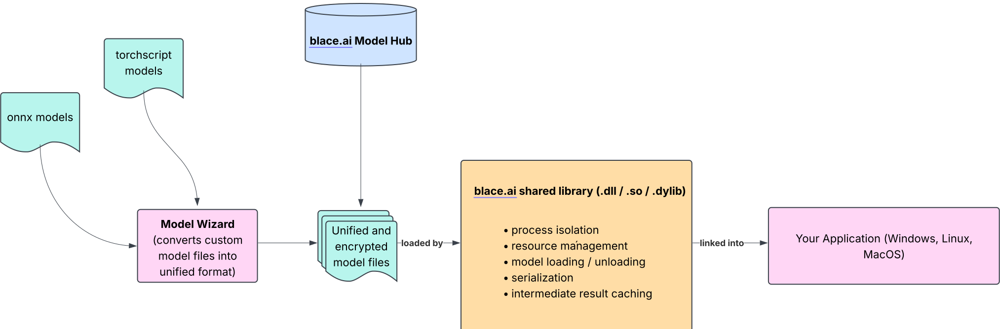
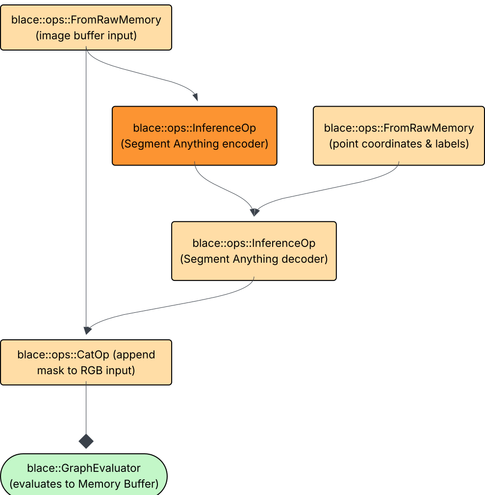
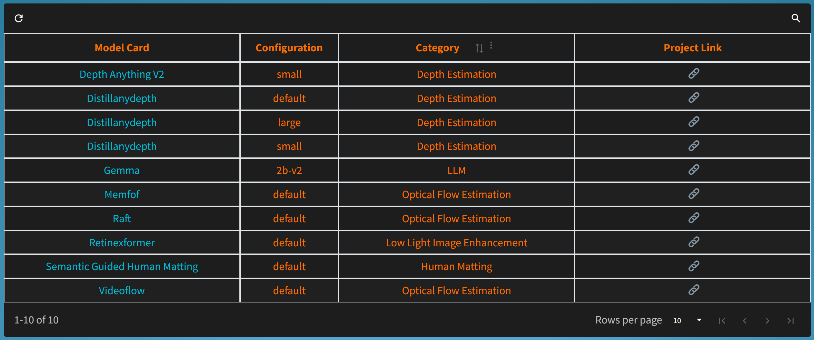

# blace.ai inference library & c++ model hub  

Welcome to blace.ai — a high-performance C++ meta-inference library that abstracts away OS, framework (PyTorch and ONNX) and hardware accelerator differences. With a unified API and minimal setup, you can easily integrate AI models into your native applications. Explore our growing model hub for plug-and-play blace.ai-compatible models built for real-world deployment.

📦 [**download sdk**](https://github.com/blace-ai/blace-ai/releases) | 🌐 [**blace.ai website**](https://blace.ai) | 📖 [**documentation**](https://blace-ai.github.io/blace-ai/) | 🧠 [**c++ model hub**](https://www.blace.ai/hub/) | 💬 [**discord channel**](https://discord.com/channels/1202176342603616277/1318605344586338404)

⚠️ **We are currently in public beta. Therefore some features are limited and the license
only allows for experimental use. We will gradually roll out the missing features 
(mostly graph operators).** ⚠️

## Overview
 <br/><br/>
## Features
-  **Cross-Platform:** Write C++ code for AI model inference once - and deploy to 
  all major operating systems (Windows, MacOS Intel/Silicon and Linux).  
- **AI-Framework-Agnostic:** blace.ai supports a growing list of frameworks and providers like Torchscript (CUDA and MPS) and ONNX (CPU and DirectML) out of the box. 
- **Self-Contained:** Our library is fully self-contained and ships with all necessary dependencies out of the box,
  making integration effortless and eliminating the hassle of managing third-party packages. Furthermore, it has **no python dependencies**.
- **Performant computation graphs:** We provide you with a set of operators that can be used to write 
  computation graphs for model inference. This is the structure of a simple computation graph running the Segment-Anything encoder and decoder seperately, automatically caching the intermediate results (dark orange node): <br/><br/>
   <br/><br/>
- **Serializable:** Built-in serialization allows you to save and transfer
  computation graphs, making it easier to integrate with distributed systems and enabling seamless scaling across multiple nodes or environments.
- **Smart models:** Models created with the [**Model Wizard**](https://blace-ai.github.io/blace-ai/md_model_wizard_creation.html) or 
  coming from the [Hub](https://www.blace.ai/hub/) store all needed configuration and 
  metadata about inputs and outputs. This eliminates the need to worry about proper model instantiation or tensor input formatting, such as memory order and sizes, streamlining the integration process.

## Hardware Support
Since the unified model format abstracts from AI frameworks, blace.ai has a deployment path for accelerated inference on most host / hardware combinations.

| Host                              | ONNX CPU | Torchscript CPU | 🏎️ Torchscript MPS | 🏎️ Torchscript CUDA | 🏎️ ONNX DirectML |
|-----------------------------------|----------|-----------------|---------------------|----------------------|-------------------| 
| Ubuntu                            | ✅        | ✅               | -                   | -                    | -                 |
| Ubuntu (NVIDIA card)              | ✅      | ✅               | -                  | ✅                    | -                 |
| MacOS (Intel)                     | ✅      | ✅               | -                  | -                    | -                |
| MacOS (Silicon)                   | ✅      | ✅               | ✅                   | -                    | -                |
| Windows (DirectML supported card) | ✅      | ✅               | -                  | -                    | ✅                 |
| Windows (NVIDIA card)             | ✅      | ✅               | -                  | ✅                    | ✅                 |

## Model Hub
[**blace.ai hub**](https://www.blace.ai/hub/) is a growing list of AI model compatible with the inference sdk. All models are carefully optimized, continuously tested on supported backends and can be integrated into .cpp applications with a few lines of code.



To request integration of a specific model, please [open a ticket](https://github.com/blace-ai/blace-ai/issues/new). 

## Quick Start  

Follow the [**Quickstart Guide**](https://blace-ai.github.io/blace-ai/md_quickstart.html#quickstart_demo) to run the first model within a few minutes.

Integrating AI models into your software should be simple. With Blace.ai, you can run AI model inference with just a few lines of code — across **Windows, Linux, and macOS**:  

```cpp
#include "blace_ai.h"

// include the models you want to use
#include "depth_anything_v2_v8_small_v3_ALL_export_version_v17.h"

void runDepthModel(std::string input_file, std::string output_file) {
  workload_management::BlaceWorld blace;

  // load image into op
  auto image_mem = raw_memory_from_file(input_file);
  auto world_tensor_orig = CONSTRUCT_OP(blace::ops::FromRawMemoryOp(image_mem));

  // interpolate to size
  auto interpolated = CONSTRUCT_OP(ops::Interpolate2DOp(
      world_tensor_orig, 700, 1288, ml_core::BICUBIC, false, true));

  // construct model inference arguments
  ml_core::InferenceArgsCollection infer_args;
  infer_args.inference_args.backends = {
      ml_core::TORCHSCRIPT_CUDA_FP16, ml_core::TORCHSCRIPT_MPS_FP16,
      ml_core::ONNX_DML_FP32, ml_core::TORCHSCRIPT_CPU_FP32};

  // construct inference operation
  auto infer_op = CONSTRUCT_OP(ops::InferenceOp(
      depth_anything_v2_v8_small_v3_ALL_export_version_v17, {interpolated},
      infer_args, 0, util::getPathToExe().string()));

  // normalize depth to zero-one range
  auto result_depth = CONSTRUCT_OP(ops::NormalizeToZeroOneOP(infer_op));

  result_depth = CONSTRUCT_OP(ops::SaveImageOp(result_depth, output_file));

  // construct evaluator and evaluate to cv::Mat
  computation_graph::GraphEvaluator evaluator(result_depth);
  auto eval_result = evaluator.evaluateToRawMemory().value();

  return;
}
```

## Installation  

Integrate blace.ai into your CMake project with just two lines.

```
include("../cmake/FindBlace.cmake")
target_link_libraries(<your_target> PRIVATE 3rdparty::BlaceAI)
```

## Roadmap 
- [**IPC Version ☂️**](https://blace-ai.github.io/blace-ai/md_ipc.html)
- for feature request please contact us via mail or open an issue here 

## Origin
Originally developed as the internal framework for [Blace Plugins'](https://blaceplugins.com/) AI-driven video editing tools, blace.ai has proven its reliability in production environments. Recognizing its potential to benefit a broader audience, we are thrilled to release blace.ai to the public.

## Feedback & Bug Repots
Please [open a ticket](https://github.com/blace-ai/blace-ai/issues/new) or reach out to contact [at] blace.ai  
